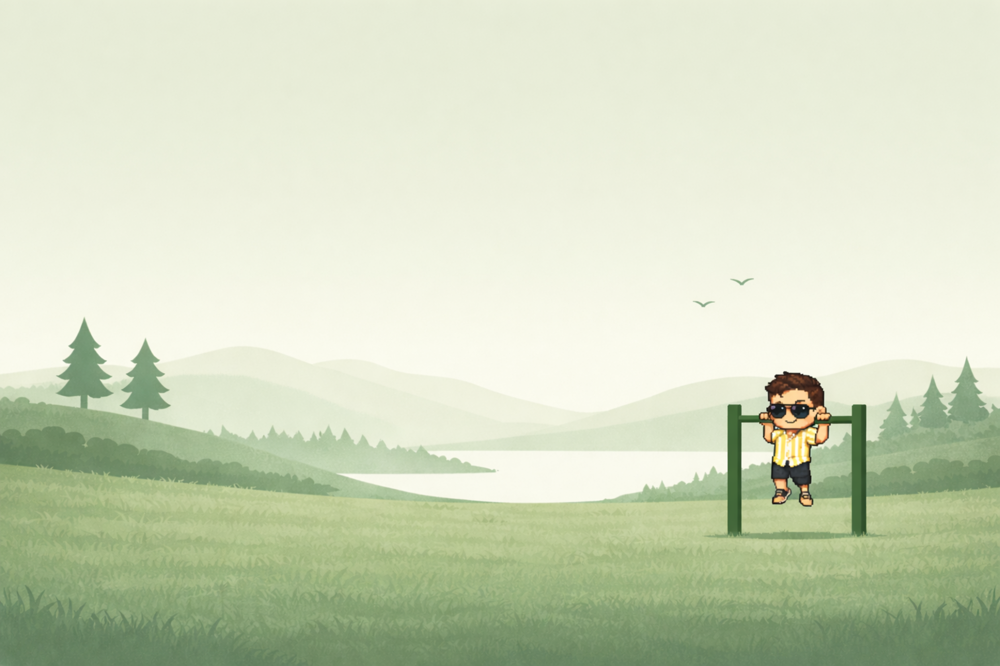

# A place that could only be mine

Website direction · Glen Padua · 26 September 2026

This is the creative and strategic direction for the next glenpadua.com. It records intent, not a finished design or an implementation prescription. The first scene will help establish the visual language before the whole site is planned and built.

## Why I am rebuilding

AI is changing what one person can make. I want my website to show what I can do with that possibility: imagine something specific, direct the tools deliberately, and carry the result through to a thoughtful, working experience.

A conventional portfolio of job titles, technology logos, and project cards no longer feels sufficient for the future I want. My experience still matters. Its value should be visible in the decisions I make, the quality of what I ship, and the problems I can solve.

I want to build more options for my future alongside my job: consulting, useful software, independent products, small experiments that grow into businesses, and opportunities I cannot yet name. This website should give that work a home and help the right people find me.

It should also feel like a person lives here. Calisthenics, travelling, curiosity, and the things I enjoy belong in the same picture as my engineering work.

## The promise

**A personal world, built with imagination and engineering care, where people can discover who I am, use what I make, understand how I think, and start a worthwhile conversation.**

The site itself is part of the evidence. Its restraint, responsiveness, accessibility, and reliability should say as much about my ability as its visual ambition.

## AI expands the canvas; I keep authorship

I want to push what is possible with AI while staying in control of the result. AI can help create artwork, explore ideas, write code, and accelerate iteration. I remain responsible for the direction, the choices, and the quality.

Creativity lives in having a point of view and following it through. Generating something impressive is a beginning. Choosing what belongs, making it coherent, and caring about the details are the work.

The website should demonstrate that relationship through its execution. Technical explanations and process notes can reveal how something was made when they help a curious visitor. They should never become a prerequisite for appreciating or using it.

## A world made from things I love

Imagine each scenic section as a small, living diorama. It has a place, an atmosphere, and something happening within it. A recurring sprite of me gives the world continuity: doing pull-ups or push-ups, travelling, or taking part in another activity grounded in my actual interests.

The supplied reference establishes the first direction: soft green hills, a quiet lake, layered trees and grass, distant birds, generous open sky, and a small, playful character at a pull-up bar. The landscape feels calm and spacious. The character gives it personality without taking over the frame.

Depth, parallax, environmental motion, and character animation should make the scene feel alive. Movement needs a rhythm and a reason. The landscape should still be beautiful when it is still.

The open space is part of the composition: it gives words room to breathe. Every scene must accommodate meaningful information about me and my work, with deliberate typography, readable contrast, and clear navigation. Text must remain real, selectable page content.

The scenes should develop a consistent visual language while allowing different moods and activities. They do not need to turn every article, tool, or project page into a full scenic experience. Those places need layouts suited to reading, understanding, and doing.

## Experience made visible

My years as a developer should come through in the work and its explanation. Show the problem, my contribution, the choices, the tradeoffs, and the result. Use verified career details wherever a timeline or experience summary is useful; choose precise claims over inflated ones.

The portfolio can hold substantial projects, independent products, experiments, and eventually consulting work. Make their status clear. An experiment can be valuable on its own terms without pretending to be a proven business or a production system.

Larger projects can have their own homes and be linked from here. Small, helpful applications can live directly on the site under their own routes, easy to bookmark, share, and use again.

Writing should become another way to demonstrate understanding. Interactive articles can let readers explore an idea, change an input, or try a working example. Every article still needs a strong reading experience without the interactive enhancement.

## Work closely with the problem

The consulting direction I am drawn to is hands-on: understand how a business actually works, find a worthwhile problem, decide where software or AI can help, build the solution, and help it become useful in practice.

This takes inspiration from forward deployed engineering: close collaboration with the people doing the work, responsibility from discovery through delivery, and success measured by adoption and practical impact. The title does not need to appear on the website. The approach does.[1]

I want people to see someone who can connect business needs, product judgment, and engineering execution. AI is one of the tools available. The outcome might be a custom application, an integration, a simpler workflow, or automation that gives people time back.

This can grow alongside my current job. The public tone should be personal, confident, and understated, with a clear, low-pressure way to discuss a problem or a possible collaboration. Availability and scope should reflect what I can actually take on.

As consulting work develops, real case studies and outcomes can make that invitation more explicit. Claims about clients, impact, and experience must follow evidence and permission to share. The site can support lead generation without feeling like a sales funnel at every turn.

## Discovery is part of the experience

A visitor should quickly understand who I am, what I make, and where to go next. Someone arriving directly at a blog post, useful tool, or project should receive a complete experience without having to enter through the scenic homepage.

Search visibility belongs in the foundation: meaningful page content, semantic structure, crawlable links, descriptive titles and metadata, stable URLs, and useful writing that answers real questions. Existing valuable URLs should be preserved or deliberately redirected when the site changes.

The scenery should invite exploration. Navigation should let people reach their destination immediately. Reading an article, finding a project, or contacting me must never depend on discovering a hidden interaction or waiting through an animation.

## Engineering is part of the creative standard

Performance, accessibility, and responsiveness are qualities of the finished design. They need to shape the first scene, not arrive as repairs at the end.

- **Fast and economical:** useful content appears promptly. Load artwork and interactive code deliberately, stop work that is offscreen or in a background tab, and respect device memory, battery, and bandwidth. Measure on representative mobile hardware and constrained connections as well as desktop.
- **Accessible by design:** semantic content, keyboard access, visible focus, readable contrast, and sensible reading order. Respect reduced-motion preferences and provide a way to pause ongoing decorative motion. No essential information should exist only in a canvas, a sprite, a hover state, or an animation.
- **Composed for each screen:** mobile deserves its own considered arrangement of scenery, character, text, and controls. Content must remain readable with zoom and larger text. A wide illustration squeezed into a narrow viewport is not a mobile design.
- **Resilient:** the core content and navigation should remain useful if advanced rendering is unavailable or an enhancement fails. A static scene is a valid, intentional experience.
- **Maintainable:** content, artwork, and behavior should be understandable and adjustable. New scenes should build on a foundation proven by the first one, without forcing every future page into the same mold.

Choose technology by what the experience needs and what testing demonstrates. Three.js, layered artwork, sprites, CSS, canvas, and other approaches remain available. This manifesto commits to an experience and a quality standard; the renderer is still an open decision.

## Prove one scene, then design the world

The next step is one working scene based on the lakeside calisthenics reference. It is a test of how much can be achieved in a focused first pass and where careful refinement makes the difference.

That scene should combine the landscape, a recognizable animated character performing one convincing exercise, restrained depth and environmental motion, and a real content area introducing me with a useful next action. Start with one exercise loop; additional activities can follow once the character and movement hold together.

Evaluate it against the reference and the intended feeling, with particular attention to:

- Landscape composition, atmosphere, and the balance between scenery and information.
- Character likeness, consistent proportions, physical contact with equipment, and a natural animation loop.
- Clean artwork boundaries and depth that still hold up when layers move.
- Readability and navigation on desktop and mobile, with keyboard input, enlarged text, and reduced motion.
- Loading cost, animation smoothness, and the quality of the still or fallback experience.

Record what the first pass achieved, what remains approximate, and what needs new artwork, animation work, or a different rendering approach. A successful screenshot alone cannot establish that the scene works as a website.

Once that base feels right, plan the broader experience: content hierarchy, scene concepts, visual references, character states, transitions, responsive compositions, and the path from discovering work to making contact. Then design and build the full site with those decisions in place.

The final scene list, navigation model, renderer, asset workflow, and consulting copy remain open. This document should guide those choices without pretending they have already been made.

## What success looks like

People remember the site and recognize a person behind it. They can understand my experience, discover something useful, and see evidence that I can carry an ambitious idea into a dependable result.

Over time, the site helps my writing, projects, tools, and relationships accumulate value. It brings relevant conversations and creates room for income beyond my job, while staying enjoyable to make and sustainable to maintain.

I want to keep returning to this space because it gives me somewhere to explore, build, and share. It should grow with the person I become.

## Reference notes

The primary source is Glen's direction supplied on 26 September 2026. The image above is preserved from the accompanying attachment, originally named `ChatGPT Image 26 Sept 2026, 07_36_19.png`. It is a visual reference, not a production asset or a commitment to a particular rendering technique.

The earlier [Website brainstorming conversation](https://chatgpt.com/share/6ab759eb-3ea0-83ec-a86d-84ad436066b6) provides background on animated scenery, sprites, and layers. Its implementation advice is reference material rather than a requirement for this direction.

[1] [OpenAI's Forward Deployed Engineer role description](https://openai.com/careers/forward-deployed-engineer-%28fde%29-sf-san-francisco/), consulted 26 September 2026, describes responsibility across discovery, scoping, building, production rollout, and customer adoption. It informs the working approach described here, not a claim that Glen holds that role or has an affiliation with OpenAI.
