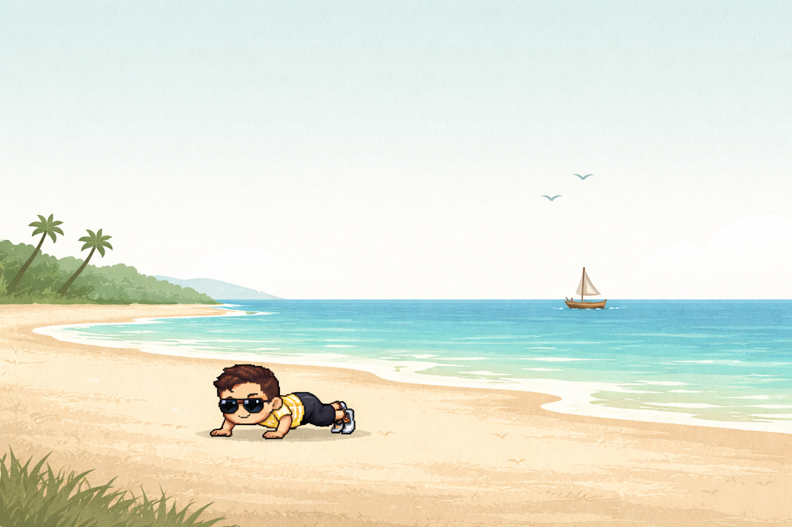
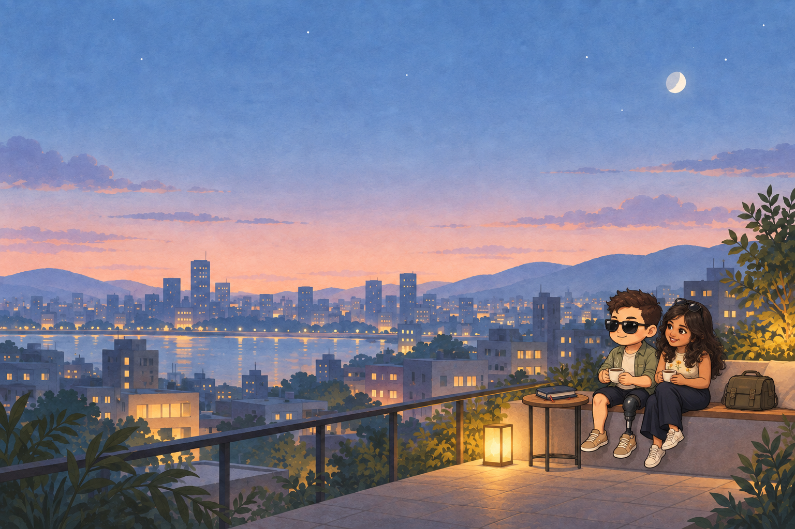
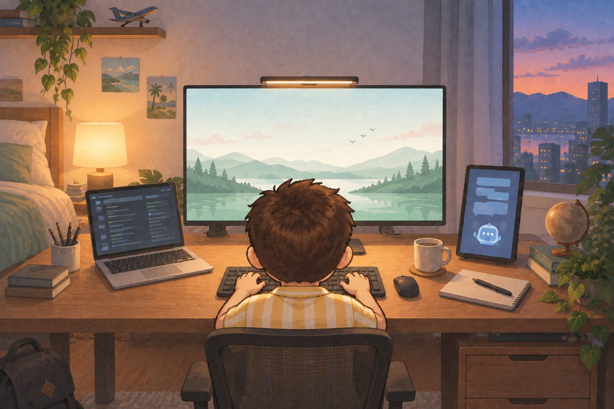
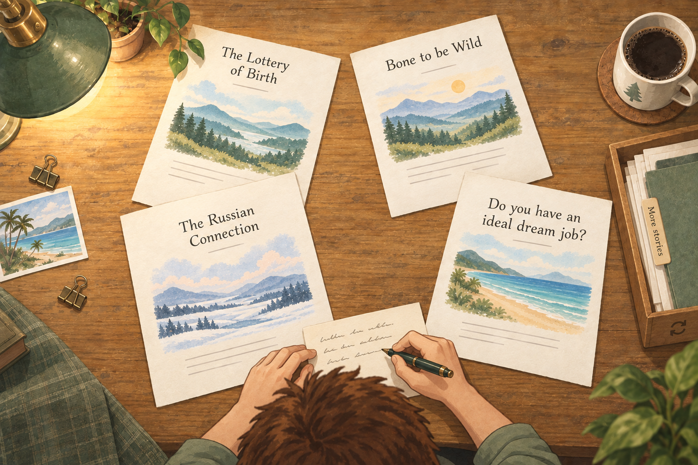

# Scene family — static art studies, first pass

26 September 2026 · Generated references for discussion, not production assets or approved layouts.

The first step is to see the complete visual family. Refine the illustrations before returning to a high-fidelity static HTML mock. No new animation, scene implementation, live AI, or video integration is part of this step.

## Existing anchors

The original lake and beach references stay intact. They establish the soft painted environments, paper texture, restrained scenery, room for copy, and small contrasting character.

## City at night

Glen requested Millusha beside him, sharing coffee or wine. Version 2 chooses coffee for this pass, using the three supplied photos to guide her stylised likeness. Both sit together at the lower right; Glen’s anatomical left prosthesis remains visible. The city, warm horizon and open sky retain the original atmosphere. The [solo version](city-night-v1.png) stays available for comparison.

The scene now makes room for both personal storytelling and future navigation. No copy or hotspot UI is baked into the image; those should remain editable, accessible layers in the later static HTML mock. These are proposed object mappings, not final destinations or implemented actions.

| Area / object                             | Future role                                 | Composition requirement                                                                   |
| ----------------------------------------- | ------------------------------------------- | ----------------------------------------------------------------------------------------- |
| Upper-left sky, roughly x 8–52%, y 10–38% | Heading and short personal copy             | Keep a calm text area; test actual typography and contrast later                          |
| Notebook on the small round table         | Stories link                                | Separate silhouette and room for a focus/hover label                                      |
| Satchel beside Millusha                   | Work link                                   | A subtle marker can identify the destination; do not assume a bag alone communicates Work |
| Lantern beside the table                  | Optional light/mood interaction             | Distinct from navigation; no essential action hidden here                                 |
| Couple / coffee cups                      | Optional personal moment or small animation | No invented anecdote or automatic link to Millusha’s profiles                             |

Keep direct route navigation available. On a phone, recompose the copy and couple/props rather than cropping away Millusha or shrinking every target. The existing city headline should be reconsidered around this shared-life moment; final copy remains open.

## Bedroom workstation

Updated camera direction from Glen: the visitor looks from behind his head and torso towards the monitor as he types. The desk and main screen dominate, laptop and small objects sit alongside, and only portions of the bedroom appear around the edges. The rear-view crop naturally hides the legs; their absence from this view does not change the character’s left prosthesis.

Glen confirmed the core rear-view composition works. Further refinement is deferred: the main monitor must accommodate substantial usable content, so reserve an unobstructed display area and adjust character/screen proportions around that requirement. The screen will eventually contain real interface content, not just a baked image. Glen also wants different clothes in the workstation; the exact outfit remains open. Version 3 still uses the earlier striped shirt, and his hair overlaps the lower central display area. The previous [wide room version](workstation-bedroom-v2.png) is retained for comparison.

## Overhead writing table

Glen confirmed the overhead perspective and requested a glimpse of himself writing. Version 3 adds the crown of his head, shoulders in a sage shirt, and hands writing on a separate note at the lower edge. Four featured article titles stay unobscured. A wooden tray with a small shuffle mark offers a future next-set interaction; the More stories archive remains available. The [previous table-only study](writing-table-v2.png) is preserved.

### Future interaction notes — static art only for now

- Glen suggested the lamp could flicker. Explore a rare, gentle variation in its warm glow; keep readable paper lighting stable, avoid sharp flashes, and stop the effect with reduced motion or pause. No animation is implemented now.
- Activating the tray’s shuffle mark can gather/redeal the featured sheets and reveal another set of articles. Keep the action deliberate, offer successive sets without immediate repeats, and preserve access to the full archive. A reduced-motion version simply replaces the set.
- Keep shuffle and archive as distinct named controls in the later mock: “Another set” and “All stories.” Titles become real links; the drawn symbol only establishes where the object might live.
- Glen’s separate note can later support a small writing loop without covering or changing the article sheets. Character movement is deferred.

### How the writing table scales

- Keep roughly three to five featured sheets in the composition; the choice can change over time.
- A visible archive object leads to a readable, searchable list of all posts, with topic/date browsing as needed.
- In the later HTML mock, overlay titles as real text on reusable paper surfaces. These raster titles test the idea only; article updates must not require image generation.
- Use a separate phone composition with fewer visible sheets and the same archive access. Do not make text smaller just to fit the desktop spread.
- Overlap paper corners and props, never the title or essential interaction area. Every sheet has a normal accessible link counterpart later.

## What to judge now

1. Do the exterior and interior scenes belong to the same painted world?
2. Does the city have the right atmosphere, and does the bedroom feel personal enough?
3. Does Glen stay recognisable, with the anatomical left prosthesis on the correct side?
4. Is the monitor large and clear enough to become the work interface?
5. Does the table feel pleasantly scattered but easy to browse?

These are wide art-direction references. Final mobile composition, typography, accessibility, and responsive behaviour remain for the later HTML mock. We have not generated a separate mobile asset set or established production asset sizes.

## Reproduction

Generated using the built-in image-generation tool, with the existing lake and beach supplied as style/character references. The exact initial three prompts are saved in [prompts-v1.json](prompts-v1.json); targeted correction prompts are in [refinement-prompts.json](refinement-prompts.json). The subsequent rear-view bedroom revision uses [bedroom-v3-prompt.txt](bedroom-v3-prompt.txt). The writing-presence revision uses [writing-v3-prompt.txt](writing-v3-prompt.txt), with the previous table as its edit target and the bedroom character as a supporting reference. Both use the built-in tool. The couple revision uses [city-v2-prompt.txt](city-v2-prompt.txt), with the previous city as its edit target and Millusha’s three user-supplied photos as likeness references; temporary PNG copies resolved the generator’s JPEG input error. The original personal photos are not copied into the repo. All selected studies are saved alongside this document; the original references remain unchanged.

The bedroom's first generation added an unrequested dog; the correction removes it. The writing-table correction replaces invented miniature character/landmark scenes with neutral landscape placeholders. Final article art should follow the actual story, not an inference from its title.

The [main storyboard](../README.md) records the newer overhead-table direction. The existing HTML board still contains the older bookshelf sketch and should be revised only after this image pass is discussed.
