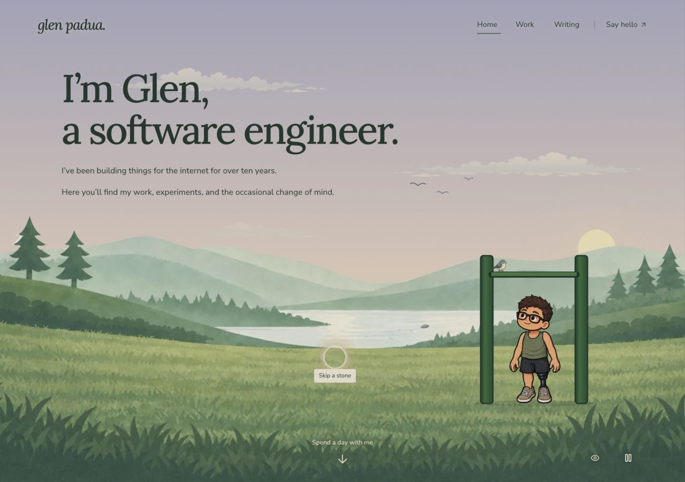

# Lake stone and bird — 30 September 2026

**Current refinement:** Glen requested a smaller, better-blended pebble and a bird that enters from one screen edge and exits through the other. The follow-up uses a 22px softly shaded pebble and a 7-second visit with measured screen edges. See [the updated verification, artwork and exact prompt](refinement.md). The notes below preserve the first implementation's evidence.

Implements Glen's approved ideas 3 and 4 in the opening scene. Tap the little stone for three diminishing skips and water ripples. After the introduction, a tiny bird visits the fixed bar during Glen's grounded rest: arrival, perch, head tilt/blink, Glen's glance and departure, then the workout resumes. The first visit takes about 30 active seconds; later visits have at least 46 seconds of quiet. These details follow the [shared art style](../../art-style.md). The earlier approved introduction and “a human in the loop.” line remain intact.

## Observed

- Desktop, 1280×900: watched the complete bird visit and the return to pull-ups. The bird's feet meet the bar without a floating gap. Glen's original body, hands, feet and anatomical left prosthesis remain the original atlas pixels; only his head changes during the glance. Arrival, perch, glance, tilt and departure screenshots accompany `bird-trace.json`. Its first recording predates a correction to the diagnostic phase attribute; the accurate grounded `rest` is recorded in `portrait-bird-trace.json` and `production-trace.json`.
- Stone: watched all three arcs, all three ripple contacts and expiry, followed by the stone's return to its resting position. Ripples stay inside the actual painted shoreline. `stone-trace.json` and `portrait-stone-trace.json` record the transforms and ring visibility. The production trace also records a skip during the bird visit, with both returning to their usual state.
- Portrait viewport, 390×844: watched arrival, perch, glance, departure and resumed pull-ups. The stone target is 44×44 CSS pixels, fully within the viewport. At 320×844 it remains 44×44 and fully visible; neither width has horizontal document overflow. These are browser viewport checks, not physical phone tests.
- Keyboard: Space and Enter activate the stone. Focus remains on its button after the throw. The shared orb shows its label and focus treatment. Native pointer activation at the portrait opening leaves `scrollY` at zero. Some Playwright locator actions scroll the page while bringing an element into view; those screenshots are recorded at their actual scroll position.
- Pause: an active throw's stone, bird and exercise transforms remained identical across an 800 ms paused interval. Resuming finished the throw. Clicking the stone with motion paused gave three still ripples, then cleared them. Pausing during the portrait bird glance held both the bird and Glen's head/body; resuming completed the visit and workout.
- Inactive scene: the day arrow moved to the beach, disabled the stone control and held stone, bird and exercise transforms unchanged across an 800 ms observation (`inactive-trace.json`). The scene's effects use both the shared motion policy and `active`.
- Optional-art failure: the temporary production server deliberately served 404s for all three new assets. The bird stayed away while the workout continued through all ten original poses. A failed stone SVG initially left its control visible when the error preceded hydration; a scene-owned image probe now catches cached/early errors as well. The corrected check shows the SVG hidden and the control removed (`asset-fallback-fixed-trace.json`, `asset-fallback.jpg`). The initial failing trace is retained in `asset-fallback-trace.json` as the reason for this repair. All artwork was restored afterward.
- The restored production preview completed the full visit and simultaneous skip (`production-trace.json`, `completed-scene.jpg`), with no browser console errors captured in the healthy preview. Expected asset-load errors belonged to the deliberate failure run.
- Reduced motion uses the same disabled-motion branch as pause: no bird visits or exercise progression, and the stone gives still ripples. That branch was reviewed and the paused interaction was exercised. An explicit OS reduced-motion setting was not emulated. Existing static paintings and no-JavaScript navigation pass the rendered-content contracts. There is no unfinished animation in this change.

## Checks

- `npm run typecheck`: passed after the final source change.
- `npm run lint`: passed after the final source change.
- `npm run build -- --webpack`: passed in `/private/tmp/glen-lake-delight-build-9mun13wn`, using the changed source and installed dependencies without modifying the active development server's `.next` folder.
- After the final build, `npm run test:diorama`: **87 passed, 0 failed**, including `scripts/diorama-contracts.test.mjs`, `scripts/lake-shoreline.test.mjs`, the existing seven pull-up tests and five new choreography/shoreline checks. Node 24.14.0 was used. Existing native TypeScript module-type warnings were informational.
- Only changed source, scripts and guides were formatted; `git diff --check` passed.

## Art and ownership

Full-quality sources are in `art-source/world/`; [assets.json](assets.json) records the exact generation prompts, approved reference, registration and preparation. `scripts/prepare-lake-delight.mjs` registers the bird's six cells, the stone and the head-only glance, then `scripts/encode-art.mjs` writes served copies. New served art totals **38,754 bytes**: bird 23,462, glance 9,492 and stone 5,800. The glance-registration image compares the new head with the fixed original body.

`scenes/lake/bird-visit-motion.ts` owns choreography and the exercise clock handoff. Held poses sleep to a boundary; only bird flights, the existing drop/hop and an active stone throw use continuous frames. `stone-skip-motion.ts` owns the arcs, contacts and ripple expiry. Both additions remain lake-owned; shared discovery and motion controls are reused. The temporary production server was stopped after review, and the existing homepage preview was returned to its normal side-panel size with motion enabled.

