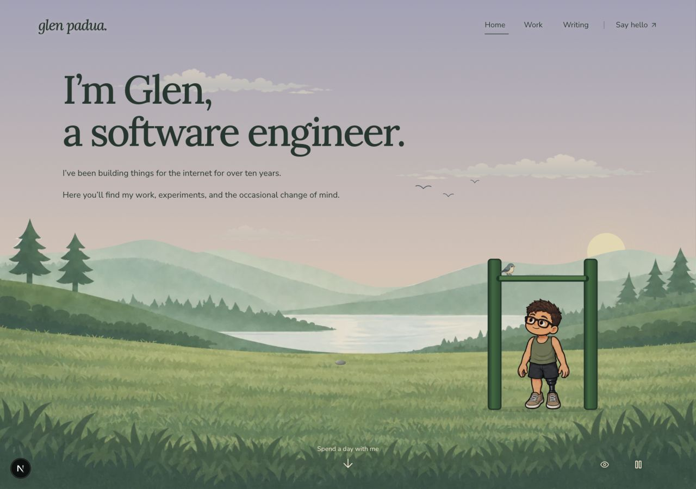

# Pebble and bird flight refinement

30 September 2026, following Glen's review of the first implementation.

The pebble now uses softer, lighter artwork at **22 painting pixels wide**, down from 36 (39% smaller). Its lower rim is quieter and the original large dark underside is softened. The original version is retained as source history. The shared discovery button remains 44×44 CSS pixels and is labelled “Skip a pebble”.

The bird now flies in from beyond the **left screen edge**, takes 2.8 seconds to approach the bar, rests for 2.4 seconds, then takes 1.8 seconds to fly out beyond the **right edge**. Its opacity changes only when the entire sprite is offscreen. The visible scene and character bounds are measured by a ResizeObserver; painting coordinates alone do not define the screen edge on a cropped portrait composition. There are no geometry reads on flight frames. The exercise clock remains held throughout the visit and resumes after departure.

## Observed and checked

- Desktop 1280×900: observed arrival through the left edge, the approach across the lower sky, landing, glance, departure through the right edge and the return to pull-ups. The route stays below the copy. Screenshots: `refined-desktop-entry.jpg`, `refined-desktop-approach.jpg`, `refined-desktop-perch.jpg`, `refined-desktop-exit.jpg`. `refined-desktop-trace.json` records positions, opacity and phase throughout the full routine, including its 7-second visit.
- Portrait viewport 390×844: observed the same complete sequence through its actual screen edges. Paused during arrival; bird position, wing frame and Glen's exercise drawing remained identical across 700 ms. Resuming continued to the bar and eventually back to pull-ups. Evidence: `refined-portrait-trace.json` and entry/perch/exit screenshots. This is viewport emulation, not a physical phone test.
- Keyboard: Space started the pebble's three skips, all three ripple groups became visible, then cleared. Focus stayed on “Skip a pebble”. The target measured 44×44 and remained wholly visible. Enter with motion paused displayed three still ripples (`refined-pebble-trace.json`). No browser console errors were captured.
- Reduced motion and inactive-scene guards are unchanged. The paused static pebble response was exercised; an explicit OS reduced-motion setting was not emulated. The earlier optional-art failure checks remain documented in the main README; the SVG and cached-error probe both use the new pebble asset URL.
- Six focused delight tests plus the seven original pull-up tests passed. The new geometry check verifies that the whole sprite starts left of and finishes right of four desktop/portrait screen sizes, moves continuously left to right and reaches the exact bar contact. Unmeasured bounds cannot provide a route.
- `npm run typecheck` and `npm run lint`: passed. Production build passed with `npm run build -- --webpack` in `/private/tmp/glen-pebble-flight-build-nr5xwlfq`, leaving the active development build folder untouched. After that build, `npm run test:diorama`: **88 passed, 0 failed**, including the required rendered-content and painted-shoreline contracts. Existing module-type notices are informational.

## Saved artwork and prompt

Built-in **image_gen** edited the existing stone, with `docs/mock/assets/lake.png` as the primary reference and [the shared art style](../../art-style.md) as the visual definition.

- Generated source: `art-source/world/lake-skipping-pebble-generated-v2.png`.
- Prepared full-quality asset: `art-source/world/lake-skipping-pebble-v2.webp`, 192×81.
- Served asset: `public/assets/world/lake-skipping-pebble-v2.webp`, **5,174 bytes**.
- Preparation: `scripts/prepare-lake-delight.mjs`, then `scripts/encode-art.mjs`.
- The exact prompt and input provenance are recorded in [assets.json](assets.json), under `lake-skipping-pebble-v2.webp`.

The final prompt was:

> Use case: precise-object-edit. Asset type: small transparent lakeside pebble for the homepage. Edit target is image 1, the existing flat skipping stone. Image 2 is the scene and primary style reference; follow docs/art-style.md, revision illustrated-world-v1. Refine only the pebble so it blends naturally with this muted dawn meadow: a flatter little worn pebble with a softer warm grey-sage colour, a very quiet cream highlight, faint paper grain and broad simple shapes. Reduce the heavy dark rim, hard black underside and contrasting mottled patches; no shine, glossy bevel, dramatic shadow or photographic stone detail. Keep a gentle irregular oval silhouette, viewed slightly from above. Width around 2.5 times height. The final on-page size will be about 22 painting pixels wide, so keep it simple and legible at that tiny size. Keep a real alpha-transparent background and generous blank padding. One pebble only; no grass, no scenery, no letters, no extra props. Preserve its quiet illustrated character rather than making it a button or jewel.

