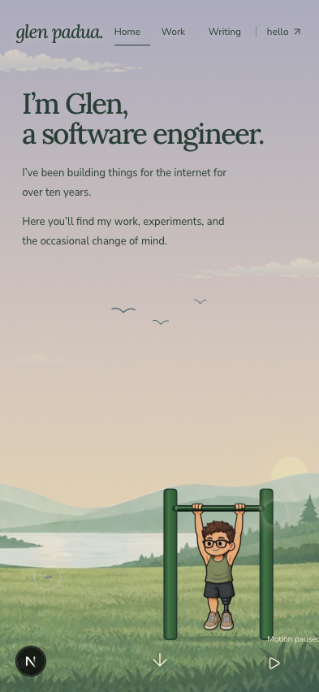
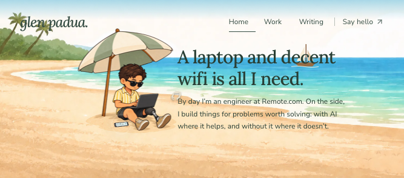

# Mobile bottom visibility · 2 October 2026

The supplied iPhone 16 Safari screenshot was materialized and visually inspected: Glen's body and the lake foreground are cut off behind the bottom toolbar, while the footer controls remain visible.

The existing painting inset used only `100lvh - 100svh`. A WebKit fixture retaining an 852px CSS viewport but reporting a 660px visual viewport reproduced the clipping: the character's bottom was about 794px. With the measured inset, the painting ends at 660px and the complete character ends at 602px. This confirms the code gap under a viewport mismatch; it does **not** establish the exact cause on the physical iPhone.

`lib/art-viewport.ts` measures the visible bottom edge, remembers the smallest visible area while browser chrome folds away, and resets on stage dimension changes. Pinch zoom and unavailable measurements preserve the composition. CSS viewport units remain the fallback. The fixed large viewport and scroll travel are unchanged; a matching ground strip continues below the painting. Short landscape phones use the wide painting crop; Beach retains its side-by-side copy and character arrangement there. Desktop styles are unchanged.

## Verification

- `npm run typecheck -- --incremental false` and `npm run lint` passed in the actual repository.
- `npm run build -- --webpack` passed in an isolated source copy using the repository's existing dependencies, keeping the shared `.next` and other preview server intact.
- `npm run test:diorama` passed: **94 tests**, including all six new viewport checks, rendered-content contracts and lake-shoreline checks.
- WebKit checked the following CSS viewports and emulated visual heights. The complete lake character remained inside the visible frame, with no horizontal overflow or page errors. Expanding and collapsing the emulated browser chrome retained the same painting position.

| CSS viewport | Visual height |
| ------------ | ------------: |
| 393×852      |   660 and 852 |
| 320×568      |           480 |
| 375×667      |           580 |
| 852×393      |           313 |
| 667×375      |           295 |
| 1440×900     |           900 |

- Reviewed all three scenes at 667×375 with a 295px visible area. Beach copy remains clear of Glen and the umbrella.
- Touch emulation passed Lake → Beach → City → ending → Lake. Pause retained the lake pose over 1.2 seconds; the inactive lake stayed still; Resume changed the pose. Reduced motion disabled the motion control as expected.
- Native iOS 26.5 Safari on the available iPhone 17 Pro simulator passed with its expanded floating toolbar: character bottom 654px, visible bottom 714px; both bottom controls end at 700px. The existing automatic viewport fit keeps browser safe areas; no extra safe-area padding or full-bleed viewport setting was added.

## Limits

The available simulator and the live website also passed before this change, so the exact physical iPhone 16 symptom was not reproduced natively. The viewport mismatch and chrome expansion/collapse checks use an explicit WebKit fixture. Native toolbar gesture testing was unavailable because the Mac was locked; a physical iPhone 16 Safari retest remains necessary. No deployment, push, merge, account change or persistent credentials were made.

